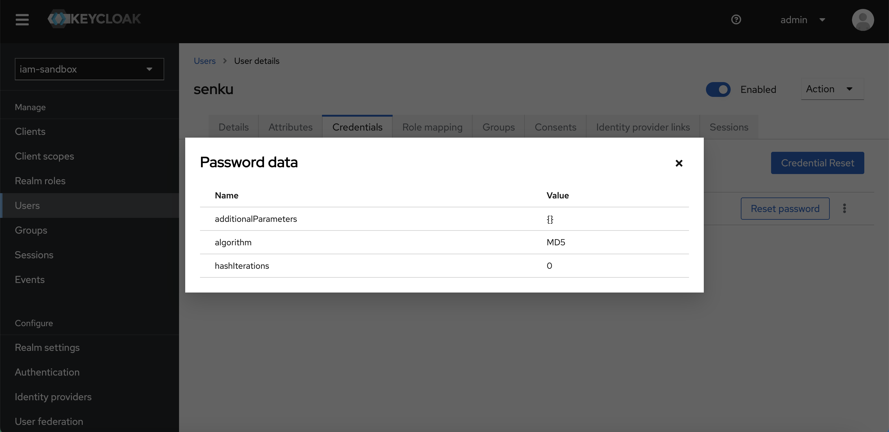
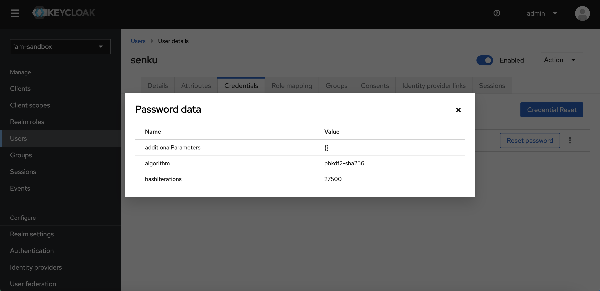

# IAM Keycloak

Docker compose for Identity and Access Management with Keycloak platform. Keycloak version I use is version 20.0.1.

## Special Case

### Migrate user data with hashing password algorithm MD5 to Keycloak

Keycloak only support PBKDF2 as hashing password algorithm. But, hashing password algorithm has been stored in user data use MD5. To make user can log in to Keycloak with their credential although hashing password change, we need to make a MD5 hashing password algorithm provider and put it to Keycloak. Luckily, I find a repository named [keycloak-md5 by mathsalmi](https://github.com/mathsalmi/keycloak-md5) to support this case. Here are the steps I do:

1. Requirements: You have JDK 11 and Maven in your local environment.
2. Clone [keycloak-md5 by mathsalmi](https://github.com/mathsalmi/keycloak-md5) repository.
3. Go to repository and run `mvn package`. This will generate a JAR package in `./target/keycloak-md5.jar`.
4. Copy that jar and put it in `providers` directory.
5. Make sure `docker-compose.yml` file mount the `providers` directory.
6. Run `docker compose up -d`.
7. Create realm in Keycloak e.g (`iam-sandbox`) and create a confidential client with OpenID Connect Protocol e.g `my-client` and set it with Service Account Roles and role of Service Account Roles named `realm-admin`.
8. I create a user with Keycloak Admin REST API and I'm using [ristekusdi/kisara-php](https://github.com/ristekusdi/kisara-php) because it wraps Keycloak Admin REST API and I'm using PHP programming language.

Here's the sneak peek of my code.

```php
<?php

require_once 'vendor/autoload.php';

use RistekUSDI\Kisara\User as KisaraUser;

// First option
$config = [
    'admin_url' => 'http://localhost:8182',
    'base_url' => 'http://localhost:8182',
    'realm' => 'iam-sandbox',
    'client_id' => 'my-client',
    'client_secret' => 'xxxxxxxxxxxxxxxxxxxxxx',
];

$data = [
    'firstName' => 'Senku',
    'lastName' => 'Ishigami',
    'email' => 'senku@dr.stone',
    'username' => 'senku',
    'enabled' => true,
    'credentials' => [
        [
            'algorithm' => 'MD5',
            'type' => 'password',
            'hashedSaltedValue' => md5('12345678'),
            'hashIterations' => 0,
            // You may set temporary if you want user to reset their password
            'temporary' => true,
        ]
    ],
];

$result = (new KisaraUser($config))->store($data);
print_r($result);
```

9. Test login user in http://localhost:8182/realms/iam-sandbox/account/ and you will be update the user password after log in.

Here's before and after user change their password. Please see the algorithm password hash.





**References**

- https://github.com/mathsalmi/keycloak-md5
- https://stackoverflow.com/questions/57771277/keycloak-migrating-hashed-passwords/74495363#74495363